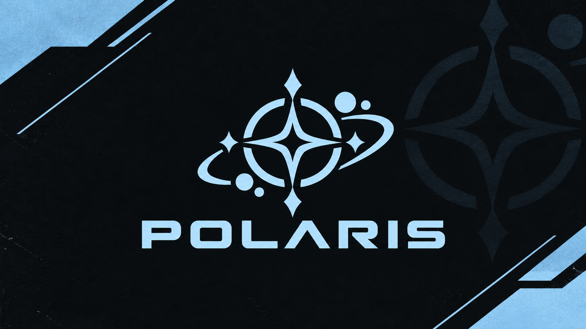

# ❄️ POLARIS 🏔️

### *Cold sky. Sharp tools. Follow the light.*

**A modular terminal toolkit for Discord automation, OSINT research, and offensive security testing.**

*Private build - not for distribution. May be released publicly in the future.*

 

 

## 🧭 Navigate

**[At a Glance](#s-glance)** &nbsp;·&nbsp; **[Overview](#s-overview)** &nbsp;·&nbsp; **[Use Cases](#s-use)** &nbsp;·&nbsp; **[Why Polaris](#s-why)** &nbsp;·&nbsp; **[Modules](#s-modules)**  
**[Themes](#s-themes)** &nbsp;·&nbsp; **[Tech Stack](#s-stack)** &nbsp;·&nbsp; **[Roadmap](#s-roadmap)** &nbsp;·&nbsp; **[What's New](#s-new)** &nbsp;·&nbsp; **[Release Plan](#s-release)**  
**[FAQ](#s-faq)** &nbsp;·&nbsp; **[Community](#s-comm)** &nbsp;·&nbsp; **[Support](#s-support)** &nbsp;·&nbsp; **[Credits](#s-credits)**

---

> [!TIP]
> **Just want a public, working tool?** Use **[Navi](https://github.com/glockinhand/navi-multitool)** - the original, stable, actively maintained version.

> [!WARNING]
> **Private use only.** Never target systems, accounts, or networks you don't own or have explicit written permission to test.

---

